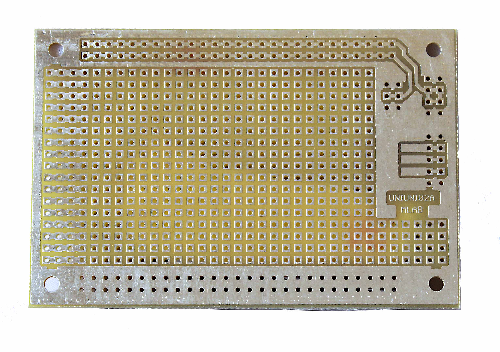

# UNIUNI02A - Universal Breadboard PCB for MLAB Kit System

## Description

UNIUNI02A is a universal printed circuit board (PCB) with a 2.54mm pitch, designed for use with the MLAB kit system. This versatile PCB allows users to realize their designs using the Veroroute tool available at [SourceForge](https://sourceforge.net/projects/veroroute/).

## Features

- **Universal Design**: Suitable for various electronic projects.
- **Standard Pitch**: 2.54mm pitch between holes.
- **Compatible with MLAB Kit**: Integrates seamlessly with other MLAB modules.
- **Power Supply Preparation**: Includes provisions for standard MLAB +5V and +12V power headers.
- **Bus Connectivity Preparation**: Equipped for connecting basic I2C, CAN, or UART TX and RX bus systems.

## Purchase Information

You can purchase the UNIUNI02A PCB from the following link: [UNIUNI02A on Tindie](https://www.tindie.com/products/35138/)
